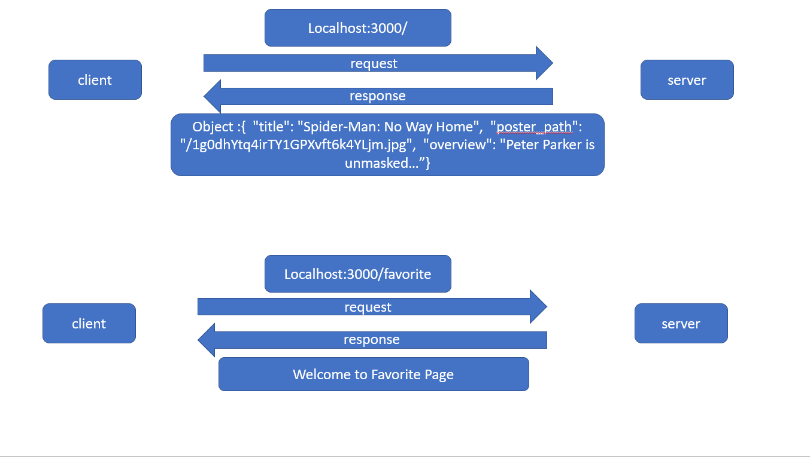
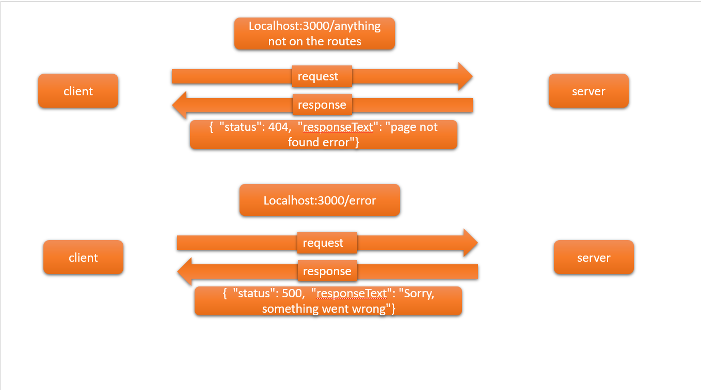

# Movies-Library-v1.0
**Author Name**: osama alkarmy

## WRRC
</img>

**Error WRRC**

</img>
## Overview
simple project5 that is a server module for a basic movie library withe a favorite page and a error massege if wrong request was sent .
## Getting Started
to start this project you should install express
"npm install express" then you could type on your ubantu "npm start" this will show a massege `Listening on 3000: I'm ready`
and in this case you are setup right.
## Project Features
 go to your borwser and wirte `localhost:3000/`
 you will see the title of "Spider-Man: No Way Home"
 and some info on this movie.
 Also if you typed `localhost:3000/favorite`
 you will be in the favorite site.
 if you typed any other path as example:
 `localhost:3000/oaufh` you will be in the page not found and the statuse will be 404 and the last case is if you typed `localhost:3000/error` you will be in the server error status 500. 